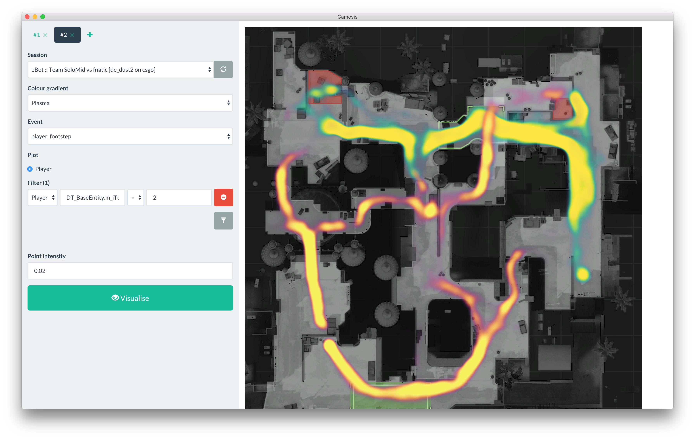

#  Gamevis

[](https://gitter.im/saul/gamevis?utm_source=badge&utm_medium=badge&utm_campaign=pr-badge&utm_content=badge)

Gamevis is an open-source [Electron](http://electron.atom.io/) application for visualising gameplay data developed by [Saul Rennison](http://saul.re) as part of his degree dissertation.

Gamevis is unopinionated and easily fits many genres of games, and includes importers for Counter-Strike: Global Offensive and Dota 2.

## Screenshot

Screenshot demonstrating two layered heatmap visualisations:



## Installation

### 1. Prerequisites

Node & npm are already expected to be installed:

```
brew install libpqxx
npm install -g gulp # required for building
npm install # install app dependencies
gulp # compile JavaScript and stylesheets
```

### 2. Database

A Postgres server is by default expected to be running on `localhost`. The `config.json` file can be updated at the root of the project to specify a non-default database IP/port.

By default the server is expected to have a database named `gamevis` with a username and password of `gamevis`.

Note that no tables need to be generated - the application will automatically generate.

### 3. Run the app

The application can be started with `npm start`. However, no sessions are available by default. The importers (see below) can be used to import game sessions into the database.

## Visualisations

Multiple visualisations can be show on a single visualisation (as shown in the screenshot):

* Heatmaps
* Timeline events (e.g., round start)
* Discontinuous points (e.g., death location)
* Continuous points (e.g., player movement)

## Importers

Game | Path | Comments
-----|------|----------
Counter-Strike: Global Offensive | `importers/csgo` | Run `import.js` with the path to the demo file as the argument.
Dota 2: Reborn | `importers/dota_reborn` | Run `import.go` with the path to the `.dem` replay file as the argument.

## Release log

Gamevis is still a work-in-progress and is not expected to be in a production-ready state until Summer 2016. However, changes are committed frequently and any issues should be raised as bugs. Of course pull requests are welcome!

## Database

Gamevis expects to connect to a Postgres database of version 9.3 or later due to JSONB querying features. This section details the structure of the database tables, that are automatically generated by the game client.

The full schema is detailed in [high-level_architecture.md](high-level_architecture.md).

## Documentation

### Read [high-level_architecture.md](high-level_architecture.md)

## License

This project is licensed under the MIT license, see [LICENSE.md](LICENSE.md) for the full legalese.

## Acknowledgements

* Logo derived from Pao Media's gamepad logo, licensed under [Creative Commons (Attribution 3.0 Unported)](https://creativecommons.org/licenses/by/3.0/).